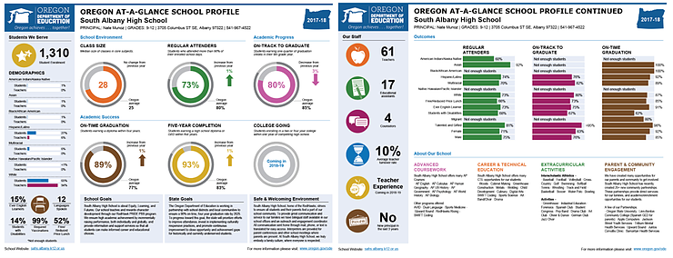
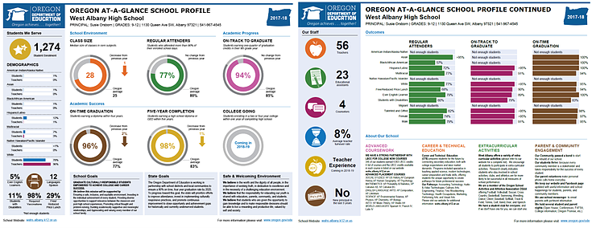
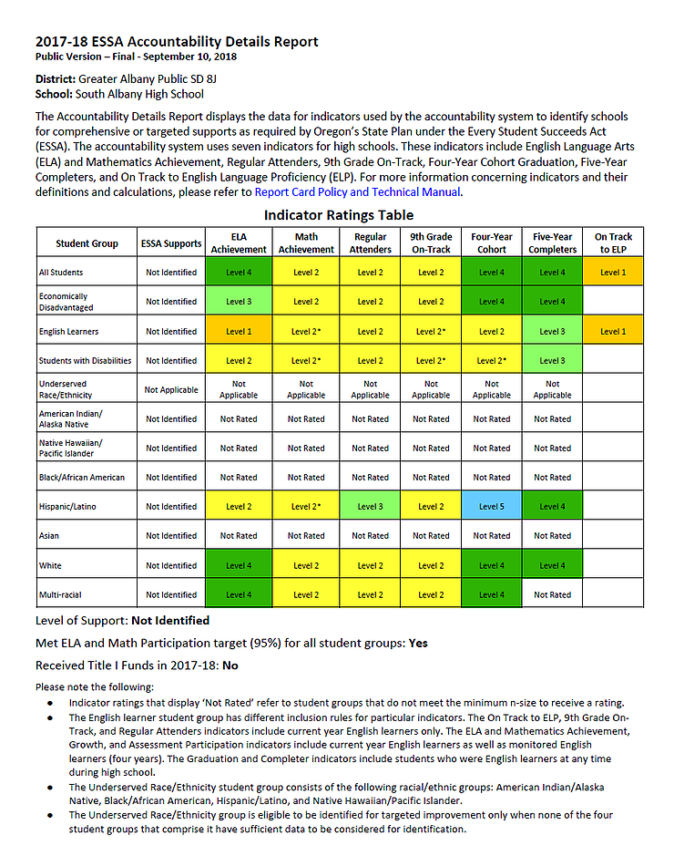
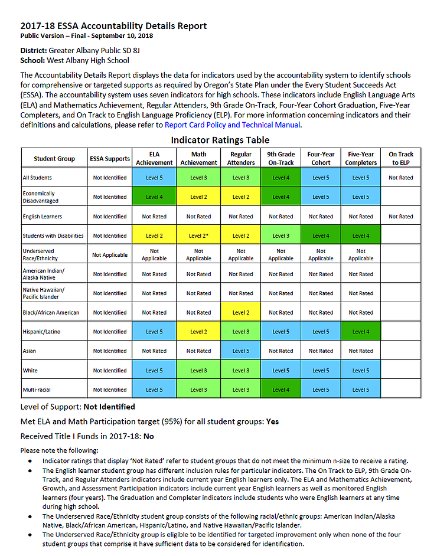

# Education Comparison in GAPS High Schools

## Header 2

The education of our graduating seniors in GAPS has decreased over the years.  We notice that discrepancy between the two High Schools in GAPS. As you can see in Figures 1-4 (see below), the difference in educational achievement is drastic between both schools.

We need to make sure that GAPS is allocating the funds not just between these two schools, but all the schools in GAPS, that way we can reasure the success of our children.

[South Albany High School Profile 2017-2018 (Figure 1)](https://oregonian.s3.amazonaws.com/school-ratings/reportcards/1718-ReportCard-650.pdf)

[West Albany High School Profile 2017-2018 (Figure 2)](http://oregonian.s3.amazonaws.com/school-ratings/reportcards/1718-ReportCard-649.pdf)

[South Albany High School Accountability Detail (Figure 3)](https://oregonian.s3.amazonaws.com/school-ratings/1718-DetailSheet-650.pdf)

[West Albany High School Accountability Detail (Figure 4)](https://oregonian.s3.amazonaws.com/school-ratings/1718-DetailSheet-649.pdf)

As you can see, if we compare South Albany High School to that of West Albany High School, we see a difference in their  education achievement.  Even though the difference in enrollment is 36 students, there are also more students from Hispanic/Latino background at South Albany High School (see Figure 1 and 2).

When we see the Latino students at South Albany High School on 9th Grade On Track, we can see that they are at Level 2, while West Albany Latino students are at Level 5.

If we do that same type of comparison with Students with Disabilities for example, we see the same type of discrepancy in achievement.  Students with Disabilities are at Level 2 with South Albany High School and at Level 3 with West Albany High School, on the 9th Grade On Track.

This is one of the reasons why I am running for GAPS School Board At Large.  I want to make sure that the funds are being allocated properly, ensure that not one school is receiving more funds than  the other, and to make sure that their is an equitable educational in GAPS.

If you have any questions, please let me know and I would love to hear from you.  You can [contact me here](https://www.miriamgcummins.com).

#GAPSeducation #MiriamGCumminsforEducation #Accountability

Sincerely,

[Miriam G. Cummins](https://www.miriamgcummins.com)

[Back](https://miriamgcummins.com)
